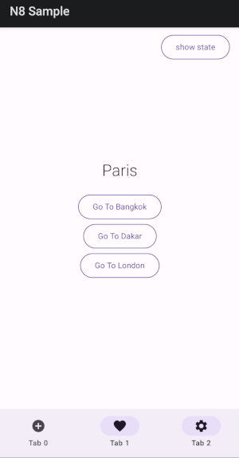

## n8 [](https://circleci.com/gh/erdo/n8)

** WIP if you want to help, open an issue and submit a PR! **

- pure kotlin
- low config
- minimally coupled
- type safe

``` kotlin
implementation("co.early.n8:n8-core:0.0.3")
implementation("co.early.n8:n8-compose:0.0.3")
```

The GPG fingerprint used to sign the maven packages is: <strong>5B83EC7248CCAEED24076AF87D1CC9121D51BA24</strong> see repo root for the GPG public certificate.

### Usage

(But see the little sample app and unit tests for the full picture)

It's not necessary to specify navigation routes upfront, n8 just builds the navigation graph
as you go, ensuring that back operations always make sense. These are the main functions your code
needs to call to navigate around the app:

``` kotlin
n8.navigateTo(Paris)
n8.navigateBack()
n8.navigateBackTo(NewYork)
n8.switchTab(mainTabs, tabIndex = 1)
```

To use n8 in your app, you don't need to implement any special interfaces on your screens, so your
UI code remains largely independent of n8 itself.

You do need to tell n8 what class you are using to keep track of your user's *Location* and your
*TabHosts* - something like a sealed class works well here, but there is nothing stopping you from
using basic Strings to identify your locations. If you don't have any TabHosts, you can just put
Unit

Here's are some examples. "Location" and "TabHostId" are your own class and nothing to do with n8 code, you
could call them "CosmicGirl" and "Loquat" if you wanted

``` kotlin
@Serializable
sealed class Location {

    @Serializable
    data object NewYork : Location()
    
    @Serializable
    data object Tokyo : Location()
    
    @Serializable
    data object Paris : Location()
   
}
```
Or perhaps slightly more realistically:

``` kotlin
@Serializable
sealed class Location {

    @Serializable
    data object Home : Location()
    
    @Serializable
    data object SignIn : Location()
    
    @Serializable
    data object Feed : Location()
    
    @Serializable
    data object Upload : Location()
    
    @Serializable
    sealed class SignUpFlow : Location() {
        @Serializable
        data object Details : SignUpFlow()

        @Serializable
        data object Email : SignUpFlow()

        @Serializable
        data object EmailConf : SignUpFlow()
    }

    @Serializable
    sealed class Settings : Location() {
        @Serializable
        data object VideoSettings : Settings()

        @Serializable
        data object AudioSettings : Settings()
    }
}

@Serializable
sealed class TabHostId {

    @Serializable
    data object MainTabs : TabHostId()

    @Serializable
    data object SettingsTabs : TabHostId()

    @Serializable
    data object CustomerSupportTabs : TabHostId()
}
```

Tell n8 what classes you decided on like this:

``` kotlin
val n8 = NavigationModel<Location, TabHostId>(
    homeLocation = Home,
    stateKType = typeOf<NavigationState<Location, TabHostId>>(),
    dataDirectory = application.filesDir
)
```

The navigationModel is observable so that your code can remain informed of any navigation
operations as they happen, but for Compose there is a wrapper that does this whilst handling
all the lifecycle issues for you. To use the wrapper, first set the navigation model as follows:

``` kotlin
N8.setNavigationModel(n8)
```

Then add the n8 navigation host, and your compose code will be updated whenever the navigation
state changes (i.e. your user has navigated forward or pressed back)

``` kotlin
setContent {
    AppTheme {
        ...
        N8Host { navigationState ->
        
            val location = navigationState.currentPage()

            // the rest of your app goes here, this code runs
            // whenever your user's location changes as a
            // result of a navigation operation
            
            ModalNavigationDrawer(
                drawerContent = ...
                content = ...
            )
        }
    }
}
```

Pass the n8 instance around the app using your choice of DI, or access it directly like this:

``` kotlin
N8.n8()
```

Call the navigation functions from within ClickListeners / ViewModels / ActionHandlers etc as
appropriate for your architecture

``` kotlin
onClick = {
  n8.navigateTo(Paris)
}
```

### Data Structure

If you want to know how all this is working, the first step is to understand the
underlying data structure used to represent the state of the navigation at any point in time.

The navigation graph is represented as an immutable tree structure, when n8 logs its state, it logs
that
tree structure from top-left to bottom-right, like a file explorer.

The first item is drawn at the
top-left location, and represents the
entry into the app, and as the user navigates to different locations in the app, the tree structure
grows down and right as locations are added in such a way that the user can always find their way
back to the home location and ultimately to the "exit", by continually pressing back.

The "current" location represents the screen the user is currently on and is typically towards the
bottom right of the graph.

Here's the state of a very simple linear navigation graph showing that the user entered on the
London screen, and is currently on the Tokyo screen:

``` kotlin
backStackOf<Location, Unit>(
    endNodeOf(London),     <--- home location
    endNodeOf(Paris),
    endNodeOf(Tokyo),     <--- current location
)
```

To exit the app in this case, the user would have to press back 3 times
(Tokyo -> Paris -> London -> [exit])

There are a few utility functions that will let you create standalone navigation graphs for use in
unit tests or constructing deep links etc:

``` kotlin
backStackOf()
tabHostOf()
endNodeOf()
```

Mostly when using the utility functions to construct standalone navigation graphs, the compiler
will be able to work out the Location/TabHostId classes for you, but if not you can specify
them like this:

``` kotlin
backStackOf<MyLocationClass, MyTabHostIdClass>(
    endNodeOf(Welcome)
)
```

Here's a more complicated nested navigation graph:

``` kotlin
backStackOf(
    endNodeOf(Welcome),     <--- home location
    tabsOf(
        selectedTabHistory = listOf(0,2),
        tabHostId = "TABHOST_MAIN",
        backStackOf(
            endNodeOf(MyFeed),
            endNodeOf(Trending),
        ),
        backStackOf(
            endNodeOf(Subscriptions),
        ),
        backStackOf(
            endNodeOf(MyAccount),
            endNodeOf(Settings),
            tabsOf(
                selectedTabHistory = listOf(0),
                tabHostId = "TABHOST_SETTINGS",
                backStackOf(
                    endNodeOf(Audio),
                    endNodeOf(Dolby),     <--- current location
                ),
                backStackOf(
                    endNodeOf(Video),
                )
            )
        ),
    )
)
```

To exit the app in this case, the user would have to press back 7 times, can you work out why? it's
related to the selectedTabHistory list

Each node of the navigation graph is a Navigation item, and as you've probably noticed from the
examples, a Navigation item can be one of 3 types:

#### 1. BackStack

A list of other Navigation items. The first item is the one closest to the exit, and for a simple
navigation graph with no TabHosts, the last item is the current item. A BackStack can contain
EndNodes or TabHosts (but can not directly contain other BackStacks)

#### 2. EndNode

Contains a single location only. The currentItem is always an EndNode. An EndNode is always
contained inside a BackStack. The very top left of the Navigation graph nearest the exit is never
an unwrapped EndNode (it will always be found inside a BackStack, and sometimes that will be inside
a TabHost)

#### 3. TabHost

Contains a list of BackStacks only (each Tab is represented as a BackStack). A TabHost cannot
directly contain either EndNodes or other TabHosts

#### Logging the state

If some n8 behaviour is confusing, it can be helpful to print out the current state of the
navigation graph.

``` kotlin
n8.toString(diagnostics = false)
```

will give you an output
similar to the examples shown above. The outputs are deliberately formatted to be copy-pasteable
directly into your kotlin code with only minor changes so you can re-create the graph for further
experimentation.

``` kotlin
n8.toString(diagnostics = true)
```

will display parent and child relationships, that's useful for library developers diagnosing
issues or clients implementing custom mutations

### TabHost navigation

TabHosts can be nested arbitrarily and are identified by an id. Changing tabs by specifying a
tabIndex, adding a brand new TabHost at the user's current location, optionally clearing the tab's
history when the user selects that tab, or breaking out of a TabHost completely and continuing on a
tab
from a parent TabHost is all supported with the same functions:

``` kotlin
/**
 * to continue in whatever tab you are on (if any)
 *
navigationModel.navigateTo(Madrid)
```

``` kotlin
/**
 * to break out of the BackStack of the current TabHost (TAB_HOST_SETTINGS say) and continue in
 * the TabHost parent identified by TAB_HOST_MAIN
 *
navigationModel.navigateTo(Tokyo) { "TAB_HOST_MAIN" }
```

``` kotlin
/**
 * to break out of the BackStack of the current TabHost (TAB_HOST_SETTINGS say) and continue in
 * the top level navigation (which may be a TabHost or a plain BackStack)
 *
navigationModel.navigateTo(location = SignOutScreen) { null }
```

##### Structural v Temporal

TabHosts tend to treat the back operation in one of 2 different ways. n8 calls these two modes
"Structural" and "Temporal".

By Structural we mean something akin to the old "up" operation in android. Let's say you have an
app that contains a single TabHost with 3 tabs, let's say the user has built up a history on this
TabHost by selecting all 3 tabs in turn, but while they have been on the current tab, has
only navigated to 2 new locations.

The navigation graph might look like this:

``` kotlin
tabsOf(
    selectedTabHistory = listOf(2),
    tabHostId = "TABHOST_MAIN",
    backStackOf(
        endNodeOf(Houston),
        endNodeOf(Tokyo),
    ),
    backStackOf(
        endNodeOf(Paris),
        endNodeOf(Sydney),
    ),
    backStackOf(
        endNodeOf(London),
        endNodeOf(Mumbai),
        endNodeOf(Shanghai), <--- current location
    ),
)
```

**Structural** back navigation here would mean that when the
user presses back, they would visit the previously visited locations in this tab only, and then
exit the app (so in the above example, 3 clicks back to exit: Shanghai -> Mumbai -> London -> exit)

By **Temporal** we mean something more like a time based history. Let's take the example from above, a
temporal version might look like this:

``` kotlin
tabsOf(
    selectedTabHistory = listOf(1,0,2),
    tabHostId = "TABHOST_MAIN",
    backStackOf(
        endNodeOf(Houston),
        endNodeOf(Tokyo),
    ),
    backStackOf(
        endNodeOf(Paris),
        endNodeOf(Sydney),
    ),
    backStackOf(
        endNodeOf(London),
        endNodeOf(Mumbai),
        endNodeOf(Shanghai), <--- current location
    ),
)
```

In this case when the user presses back, they would re-trace their steps through the locations
visited while on ```tabIndex = 2```, and then do the same for ```tabIndex = 0```, and then
```tabIndex = 1```, before finally exiting the app.

So in our example, that would take 7 clicks back to exit:
Shanghai -> Mumbai -> London -> Tokyo -> Houston -> Sydney -> Paris -> [exit]

The n8 implements those two modes using only the **selectedTabHistory** field.

You can set the TabBackMode via the ```switchTab()``` function. The default
is ```TabBackMode.Temporal```

### Passing data

// TODO (check functionality and add tests for nested nav graphs, linear nav graphs already support this)

### Persistence

Whichever classes you chose to use to represent your Locations and TabHosts, make sure they are
serializable and n8 will take care of persisting the user's navigation graph for you locally

Notice this line in the constructor:

``` kotlin
typeOf<NavigationState<Location, TabHostId>>()
```

that's how n8 can serialise and persist your navigation state across rotations or sessions without
knowing anything about the class you chose for Location or TabHostId in advance. That line is very
important, but it can't be verified by the compiler unfortunately. n8 will let you know if it's
wrong though, either at construction, or the first time you try to add a TabHost (if one wasn't
added during construction).

### DeepLinking

// TODO (add functionality and tests)

The current state of the navigation is always exportable/importable. In fact the whole state is
serialized and persisted to local storage at each navigation step. You can take this serialized
state, send the String to someone in a message, import it into their app and thus transfer an entire
navigation state to another phone.

For deep linking you probably want to construct a custom navigation state, which is easy to do
with the helper functions, for example:

``` kotlin
backStackOf<Location, Unit>(
    endNodeOf(HomeScreen),
    endNodeOf(ProductReviews),
    endNodeOf(Review(productId=7898)),
).export()
```

The default serialized state is human readable, but not that pretty, especially once URLEncoded:

```
backStackOf%3CLocation%2C%20Unit%3E%28%0A%20%20%20%20endNodeOf%28HomeScreen%29
%2C%0A%20%20%20%20endNodeOf%28ProductReviews%29%2C%0A%20%20%20%20endNodeOf%28
Review%28productId%3D7898%29%29%2C%0A%29
```

So you might want to encode/decode as you wish before sending it to your users, but that's outside
the scope of a navigation library

### Custom Navigation behaviour

n8 tries to make standard navigation behaviour available to your app using basic functions by
default, but you can implement any behaviour you like by writing a custom state mutation yourself.

The n8 navigation state is immutable, but internally it also has parent / child relationships that
go in both directions and most of the mutation operations involve recursion, so it's definitely an
advance topic, but there are mutation helper functions that n8 uses internally and that are
available for client use too which should make life easier.

### Example custom mutation

//TODO

## Example App



There is a mini android app in this repo if you want something to play around with

### Some ideas for what to do next

- improve / simplify code comments & docs

- finish implementing code functions

- review API - can it do everything a reasonable client will need it to?
- review API - can it be further simplified
- review API - what can be made internal?
- review API - what should be made public?

- finish a simple example app

- setup circle CI to run unit tests

- look for / fix bugs

- settle on solution for transition animations (before and after state - possibly keep this in the
  compose lib)

- kmp example app + lib changes if needed

- formalise code formatter / linter

- code coverage for tests

- write an article + sample app

- release v1.0.0

## License

    Copyright 2015-2024 early.co

    Licensed under the Apache License, Version 2.0 (the "License");
    you may not use this file except in compliance with the License.
    You may obtain a copy of the License at

       http://www.apache.org/licenses/LICENSE-2.0

    Unless required by applicable law or agreed to in writing, software
    distributed under the License is distributed on an "AS IS" BASIS,
    WITHOUT WARRANTIES OR CONDITIONS OF ANY KIND, either express or implied.
    See the License for the specific language governing permissions and
    limitations under the License.
